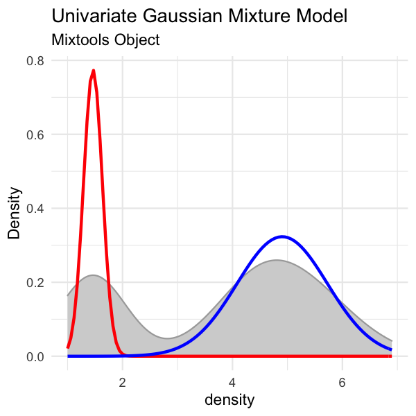
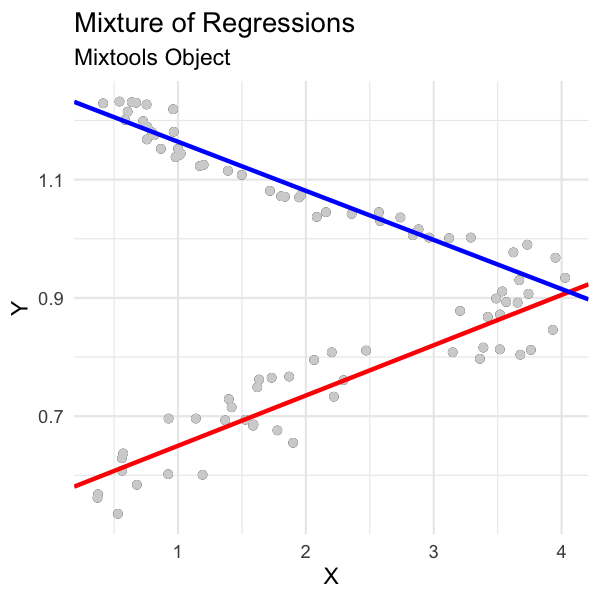
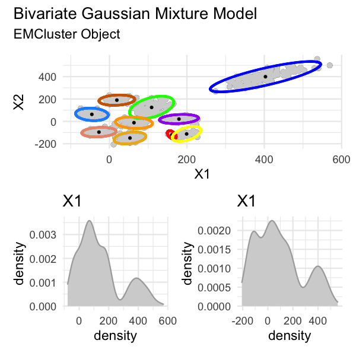
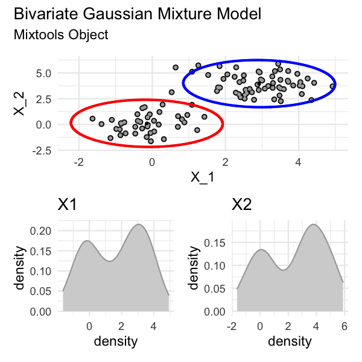
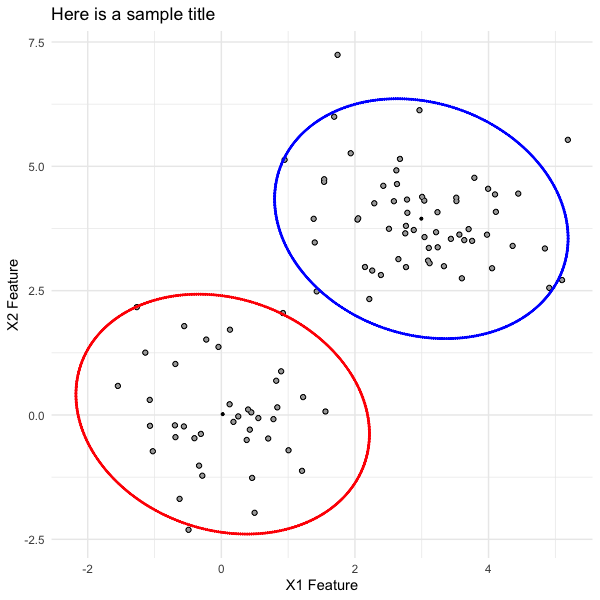
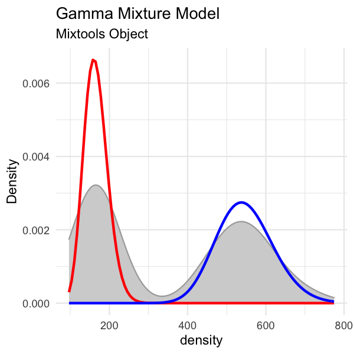

# `plotmm` Tidy Tools for Visualizing Mixture Models
[](http://cran.r-project.org/package=plotmm)
[](https://github.com/pdwaggoner/plotmm/pulls)
[](http://www.r-pkg.org/pkg/plotmm)
[](https://www.r-pkg.org/pkg/plotmm)

---
#### [`plotGMM`](https://CRAN.R-project.org/package=plotGMM):
[](https://lifecycle.r-lib.org/articles/stages.html)
[](http://cran.r-project.org/package=plotGMM)
[](http://cranlogs.r-pkg.org/)
[](https://www.r-pkg.org/pkg/plotGMM)

---

Package authors and contributors:
  - [Philip D. Waggoner](https://github.com/pdwaggoner) (pkg maintainer), Edison Software & Columbia University
  - [Fong Chun Chan](https://github.com/tinyheero), Achilles Therapeutics
  - [Lu Zhang](https://github.com/LuZhang0128), University of Chicago (formerly Emory)

---

In collaboration with [Fong Chan](https://github.com/tinyheero) (Achilles Therapeutics) and [Lu Zhang](https://github.com/LuZhang0128) (Emory University), we have developed `plotmm` for tidy visualization of mixture models. This package is a substantial update to the [`plotGMM` package](https://CRAN.R-project.org/package=plotGMM).

`plotmm` has five functions: 

1. `plot_mm()`: The main function of the package, `plot_mm` allows the user to simply input the name of the fit mixture model object, as well as an optional argument to pass the number of components `k` that were used in the original fit. *Note*: the function will automatically detect the number of components if `k` is not supplied. The result is a tidy `ggplot()` of the density of the data with overlaid mixture weight component curves (or ellipses in the 2-D , bivariate cases). Importantly, as the grammar of graphics is the basis of visualization in this package, most other tidyverse packages and functions work with any of the `plotmm`'s functions (e.g., customizing with `ggplot2`'s `labs()` or `theme_*()`; or with `patchwork`'s `plot_annotation()`).

2. `plot_cut_point()`: Mixture models can also be used to derive cut points of separation between groups in feature space. `plot_cut_point()` plots the data density with the overlaid cut point (point of greatest separation between component class means) from the fit mixture model. This function also allows for returning the cut point calculation with *no* plot, if so desired (i.e., `(... plot = FALSE)`).

3. `plot_mix_comps()`: A helper function used internally in `plot_mm()`. Can be adapted for expanded customization of mixture model plots by allowing for superimposing of components' shape curves over a `ggplot()` of the raw data. 

4. `plot_gmm()`: The original function upon which the package was expanded. It is included in `plotmm` for quicker access to a common mixture model form (univariate Gaussian), as well as to bridge between the original `plotGMM` package.

5. `plot_mix_comps_normal()`: Like `plot_mix_comps()`, this is a helper function serving as the basis of the expanded `plot_mix_comps()`, but for Gaussian mixture models only. It is included in `plotmm` for bridging between the original `plotGMM` package.

The package supports several model objects (from 'mixtools', 'EMCluster', and 'flexmix'), as well as many mixture model specifications, including mixtures of: 

1. Univariate Gaussians
2. Bivariate Gaussians
3. Gammas
4. Logistic regressions
5. Linear regressions
6. Poisson regressions

See the complementary R-Bloggers post [here](https://www.r-bloggers.com/tidy-visualization-of-mixture-models-in-r/).

## Contribute

We welcome PRs or any form of contribution to the `plotmm` package, as it's still very much in it's infancy. For example (thanks to [@DominiqueMakowski](https://github.com/DominiqueMakowski) for the language ideas below):

- Create or check existing <a href=https://github.com/pdwaggoner/plotmm/issues></a> issues to report, replicate, or debug.

- Create or check existing <a href=https://github.com/pdwaggoner/plotmm/issues></a> issues to suggest or discuss a new feature for the package.

- Check existing <a href=https://github.com/pdwaggoner/plotmm/issues></a> issues to see things that we'd like to implement, but where we need some extra help.

*If you decide to contribute, please review and abide by our [Code of Conduct](https://github.com/pdwaggoner/plotmm/blob/master/CODE_OF_CONDUCT.md).* 

# Installation

Dev version: `devtools::install_github("pdwaggoner/plotmm")`

Stable release (v0.1.0) on CRAN: `install.packages("plotmm"); library(plotmm)`

## Tidy visualization of mixture models via `plot_mm()`

First, here is an example for univariate normal mixture model:

```{r }
set.seed(123)
out <- mixtools::normalmixEM(iris$Petal.Length, k = 2)

# visualize
plot_mm(out, 2) +
  ggplot2::labs(title = "Univariate Gaussian Mixture Model",
                subtitle = "Mixtools Object")
```



Next is an example of a mixture of linear regressions:

```{r }
# set up the data (replication of mixtools example for comparability)
data(NOdata); attach(NOdata)

set.seed(123)
out <- regmixEM(Equivalence, NO, verb = TRUE, epsilon = 1e-04)

# visualize
plot_mm(out) +
  ggplot2::labs(title = "Mixture of Regressions",
                subtitle = "Mixtools Object")
```



Next is a bivariate Gaussian mixture model (via EMCluster). Note, you have a few options here. If you simply plot via `plot_mm()` without storing the plot as an object, each ellipsis for each found cluster/mixture will plot as individual plots, followed by the final and *full* plot. On the other hand, by storing your plot as in the example below (e.g., `plot <- plot_mm(model, data = x)`), then calling the saved `plot` object will render only the final and *full* plot, which can be annotated accordingly via `patchwork`.

```{r}
library(EMCluster)

set.seed(123)
x <- da1$da
out <- init.EM(x, nclass = 10, method = "em.EM")

# visualize and annotate
plot <- plot_mm(out, data = x)

plot + patchwork::plot_annotation(title = "Bivariate Gaussian Mixture Model",
                                  subtitle = "EMCluster Object")
```



Here is a bivariate Gaussian mixture model (via mixtools). As with the previous case of visualizing a bivariate Gaussian mixture model, but with `EMCluster`, so too here you have the same options for calling the final and *full* plot versus the individual ellipses plots.

```{r}
# set up the data (replication of mixtools example for comparability)
set.seed(123)
x.1 <- rmvnorm(40, c(0, 0))
x.2 <- rmvnorm(60, c(3, 4))
X.1 <- rbind(x.1, x.2)
mu <- list(c(0, 0), c(3, 4))
out <- mixtools::mvnormalmixEM(X.1, arbvar = FALSE, mu = mu,epsilon = 1e-02)

# visualize and annotate
plot <- plot_mm(out)

plot + patchwork::plot_annotation(title = "Bivariate Gaussian Mixture Model",
                                  subtitle = "Mixtools Object")
```


Further, for the bivariate cases (with `EMCluster` and `mixtools` objects), which include multiple plots `patchwork`ed together, users can "unattach" the plots comprising the full plot with simple indexing (e.g., for the scatterplot with two ellipses, call `plot[[1]]`, or for the two density plots, call `plot[[2]]`). Once stored, proceed with customization. For example, we can pull out the ellipsis plot from the `mixtools` version of the bivariate mixture model, and update the plot labels accordingly. 

```{r}
ellipsis_plot <- plot[[1]] + 
  ggplot2::labs(title = "Here is a sample title",
                x = "X1 Feature",
                y = "X2 Feature")
ellipsis_plot
```



Finally, here is a mixture of Gammas.

```{r}
# set up the data (replication of mixtools example for comparability)
set.seed(123)
x <- c(rgamma(200, shape =50, scale = 11), rgamma(200, shape = 28, scale = 6))
out <- gammamixEM(x, lambda = c(1, 1)/2)

# visualize
plot_mm(out) +
  ggplot2::labs(title = "Gamma Mixture Model",
                subtitle = "Mixtools Object")

```



### Plot cut points (or not) via `plot_cut_point()` 
#### ...with the [amerika](https://CRAN.R-project.org/package=amerika) color palette, the [wesanderson](https://CRAN.R-project.org/package=wesanderson) color palette, or the default grayscale color palette

```{r }
mixmdl <- mixtools::normalmixEM(faithful$waiting, k = 2)

plot_cut_point(mixmdl, plot = TRUE, color = "amerika") # produces plot

plot_cut_point(mixmdl, plot = TRUE, color = "wesanderson") # produces plot

plot_cut_point(mixmdl, plot = TRUE, color = "grayscale") # produces plot
```


#### Or calculate and return only the cut point *value* by setting `plot = FALSE`

```{r }
plot_cut_point(mixmdl, plot = FALSE)

# [1] 67.35299
```


### Build a custom `ggplot()` of a mixture model with `plot_mix_comps_normal()`

```{r }
mixmdl <- mixtools::normalmixEM(faithful$waiting, k = 2)

x <- mixmdl$x
x <- data.frame(x)

ggplot2::ggplot(data.frame(x)) +
  ggplot2::geom_histogram(ggplot2::aes(x, ..density..), binwidth = 1, colour = "black", fill = "white") +
  ggplot2::stat_function(geom = "line", fun = plotmm::plot_mix_comps_normal,
                         args = list(mu = mixmdl$mu[1], sigma = mixmdl$sigma[1], lam = mixmdl$lambda[1]),
                         colour = "red", lwd = 1) +
  ggplot2::stat_function(geom = "line", fun = plotmm::plot_mix_comps_normal,
                         args = list(mu = mixmdl$mu[2], sigma = mixmdl$sigma[2], lam = mixmdl$lambda[2]),
                         colour = "blue", lwd = 1) +
  ggplot2::ylab("Density") + 
  ggplot2::theme_minimal()
```

