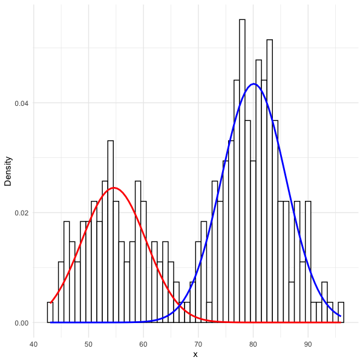

Written with Fong Chun Chan (@tinyheero), `plotGMM` provides a custom function, `plot_mix_comps`, for users interested in overlaying the components from a Gaussian mixture model. This allows for clean, precise plotting constraints, including mean (`mu`), variance (`sigma`), and mixture weight (`lambda`) of the components. Specifically, the function superimposes the shape of the components over a `ggplot2` object. We demonstrate this both in the example in the package documentation, as well as below.

```{r }
library(magrittr)
library(ggplot2)
library(mixtools)

# Fit a GMM using EM
set.seed(1)
mixmdl <- normalmixEM(faithful$waiting, k = 2)

# Plot mixture components using the `plot_mix_comps` function
data.frame(x = mixmdl$x) %>%
ggplot() +
geom_histogram(aes(x, ..density..), binwidth = 1, colour = "black",
                 fill = "white") +
   stat_function(geom = "line", fun = plot_mix_comps,
                 args = list(mixmdl$mu[1], mixmdl$sigma[1], lam = mixmdl$lambda[1]),
                 colour = "red", lwd = 1.5) +
   stat_function(geom = "line", fun = plot_mix_comps,
                 args = list(mixmdl$mu[2], mixmdl$sigma[2], lam = mixmdl$lambda[2]),
                 colour = "blue", lwd = 1.5) +
   ylab("Density")
```



This package is the first iteration of a broader project that will eventually include several other plotting and fitting tools for Gaussian mixture models and the Expectation-Maximization (EM) algorithm.
